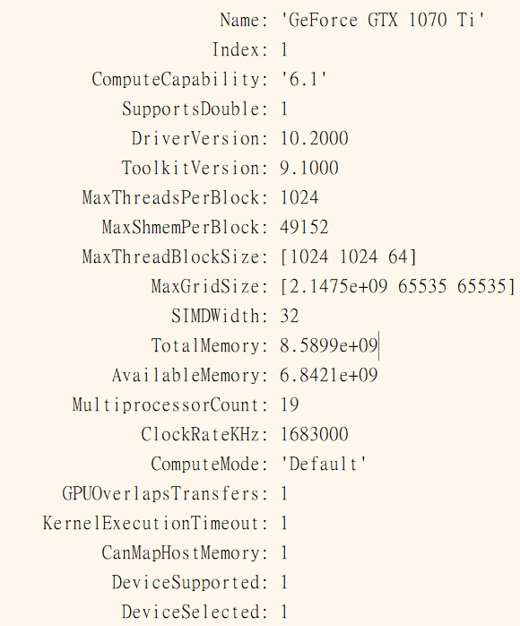

# Left_Or_Right_Eyes

# What need to do
Please download files like training database and example videos from here:https://drive.google.com/file/d/1V7BwNymPVMJeMbg9UIHqsMu_PC_ZiWPx/view?usp=sharing
And run "Exeute20180402.m"
# What the program do ?
It provides a method to identify images that which are left eye or right eye.
If we know which eye is the picture. 
We can rise the accuracy of iris location and radius. 
That's because two eyes' eyelash of people on the opposite side.

# Layer introduction
convolution

reluLayer

maxPooling

convolution

reluLayer

maxPooling

fullyConnected

reluLayer

fullyConnected

softmaxLayer

classification

# Training progress

# Accuracy of database = 0.9964
The predict data is ramdomly choosen from each 5000 from left eyes and right eyes. 

# Each one image for predict cost about 0.0003 s.

# Training equip

